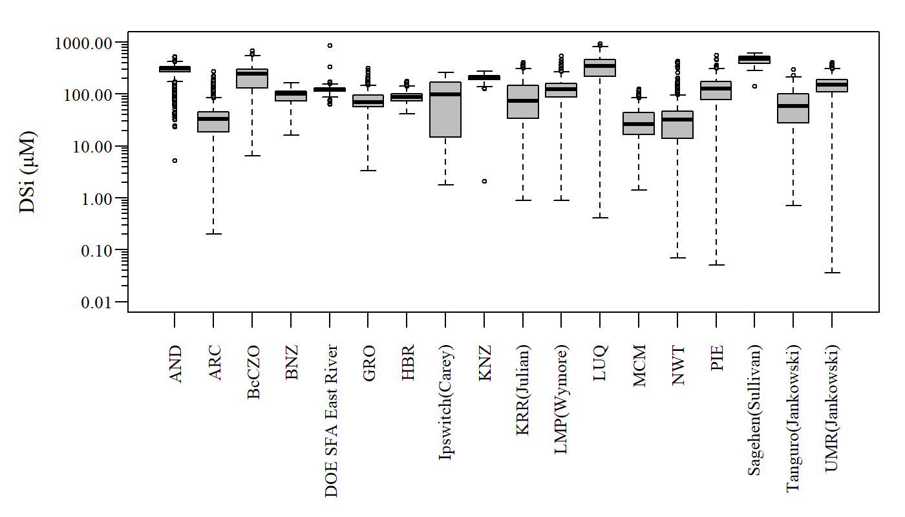
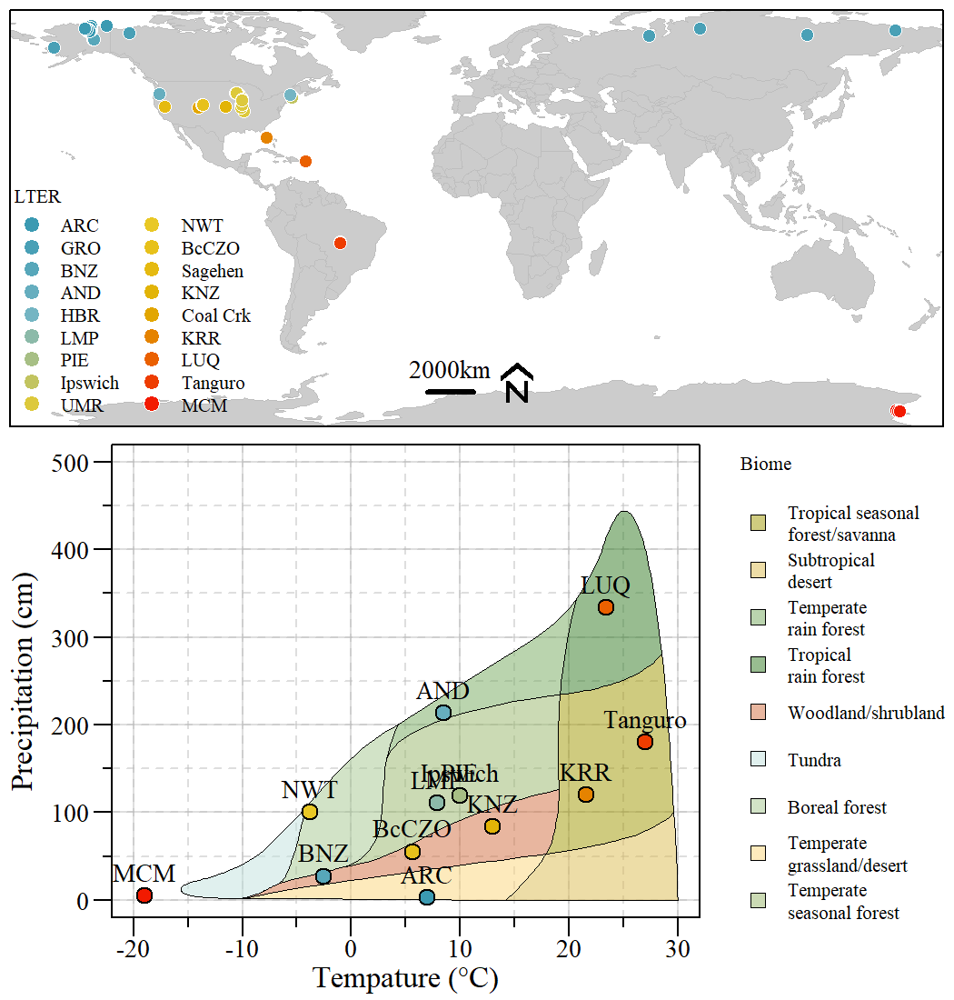
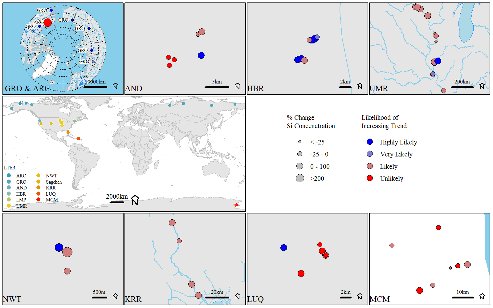
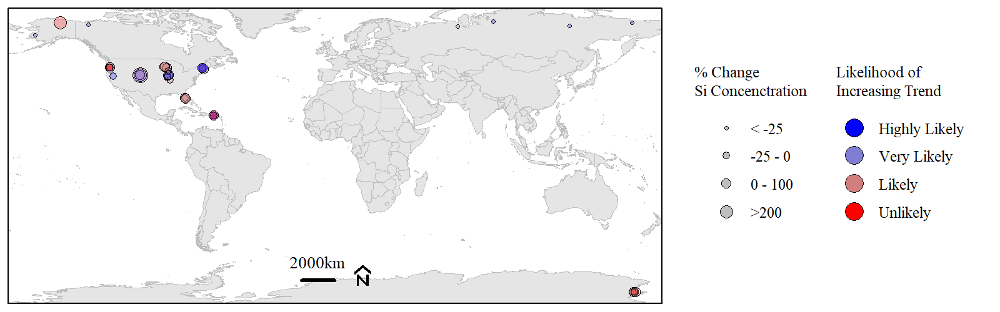
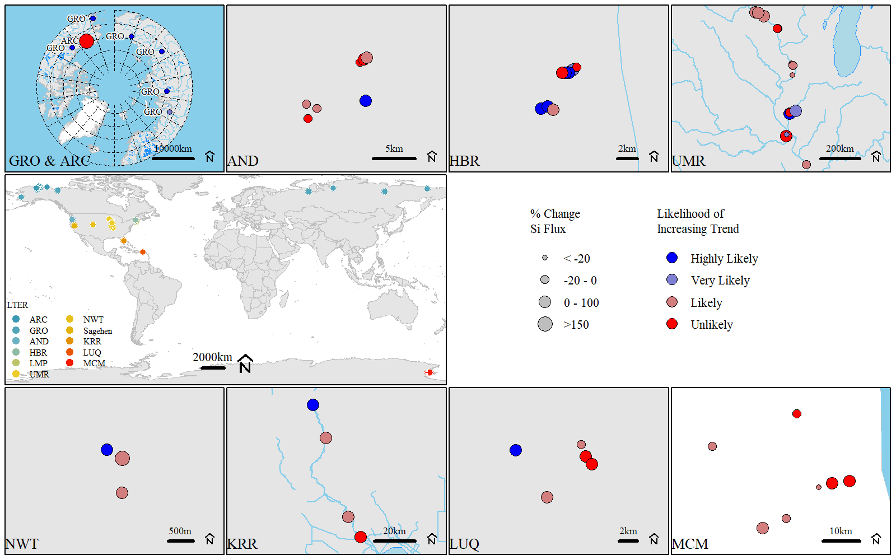
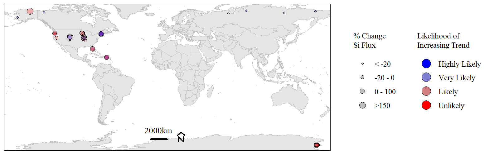

Data Inventory

================

 

### General Contents

This sub-folder holds the *Data Inventory* rmd (`/markdown`), plots
(`/Plots`) and source code (`/src`) associated with the initial data
inventory phase of the project.

-   Current data inventory hosted at
    <https://swampthingecology.org/LTER/SiSyn_DataInventory>.

### Data Updates/Versions

Data associated with this project is kept in a project specific
GoogleDrive folder. Contact PIs for more details.

This section is to document changes and/or updates to the “Master” data
file from which all working group participants will use for data
analyses.

#### Biogeochemical Dataset

-   2020-10-15: initial file (filename: `20201015_masterdata.csv`)
-   2020-11-11: File updated to fix error in merging Chlorophyll Data
    (filename: `20201111_masterdata.csv`)
-   2021-02-24: Added HBR and corrected Coal Creek data (filename:
    `20210224_masterdata.csv`)
-   2021-03-04: Updated and combined Sagehen dataset (filename:
    `20210304_masterdata.csv`)
-   2021-04-21: Fixed error in converting HBR NOx data (filename:
    `20210421_masterdata.csv`)
-   2021-05-24: Fixed error in converting NWT NOx and SRP data
    (filename: `20210524_masterdata.csv`)
-   2021-08-04: Added GRO dataset (filename: `2020804_masterdata.csv`)
-   2021-09-07: updated and added GRO high frequency sampling (filename:
    `20210907_masterdata.csv`)

Boxplot of DSi for all sites within a given ‘LTER’.

------------------------------------------------------------------------

### Analysis and Work Products

Data Inventory \|
[Link](https://swampthingecology.org/SiSyn/DataInventory/SiSyn_DataInventory.html)
\|

Concentration Discharge Evaluation \|
[Link](https://swampthingecology.org/SiSyn/ConcentrationDischarge/CQFunction.html)
\|

**Biome Map** \|

Map of ‘LTER’ sites and where they align on the Whittaker biome ‘map’
based on annual mean air temperature and annual precipitation.

Source Code: [/DataInventory/src/3\_BiomeMap.R](./src/3_BiomeMap.R)

**WRTDS Percent Change Map** \|

Percent Change of Si concentration for each LTER site with sufficient
data.

Overall Map (all sites) percent Change of Si concentration for each LTER
site with sufficient data.

 

Percent Change of Si flux for each LTER site with sufficient data.

Overall Map (all sites) percent Change of Si flux for each LTER site
with sufficient data.

Source Code: [/DataInventory/src/3\_BiomeMap.R](./src/3_BiomeMap.R)

------------------------------------------------------------------------

[Back to parent folder](https://github.com/SwampThingPaul/SiSyn)
