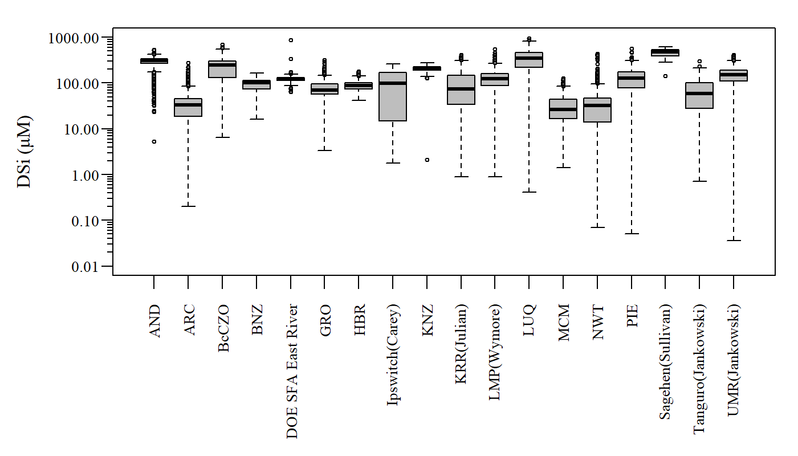
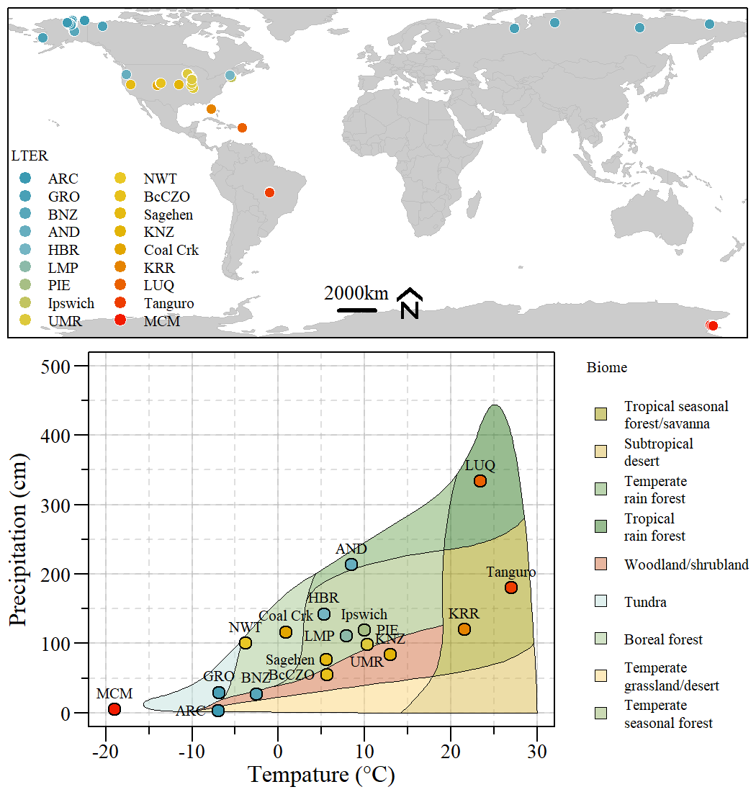

LTER Silica Synthesis
================

## FROM POLES TO TROPICS: A MULTI-BIOME SYNTHESIS INVESTIGATING THE CONTROLS ON RIVER SI EXPORTS

[Project Overview](https://lternet.edu/working-groups/river-si-exports/)

**Principal Investigator(s):** Joanna Carey, Babson College, KathiJo
Jankowski, US Geological Survey

> Riverine exports of silicon (Si) directly influence global carbon (C)
> cycling through the growth of diatoms, ubiquitous autotrophs in marine
> and freshwater systems, which account for \~25% of global primary
> production. Rivers play essential roles in processing and supplying
> the Si necessary for diatom growth, but we have limited knowledge of
> the controls on river Si exports, especially how they vary across
> biomes. Prior work has shown conflicting importance of various
> drivers, such as lithology, riverine productivity, and terrestrial
> vegetation in controlling river Si exports. Capturing a baseline
> understanding of how these factors influence Si exports across biomes
> is essential for understanding freshwater and marine C cycles,
> especially during this period of rapid climatic warming. This
> synthesis will answer three specific research questions related to the
> roles of 1) terrestrial vegetation, 2) river productivity and 3)
> climate warming in controlling river Si exports across biomes. Our
> proposed sites span the globe (e.g., Antarctic, tropical, temperate,
> boreal, alpine, Arctic systems), and present a unique cross-network
> opportunity to connect LTER-based research with that of the Critical
> Zone Observatory and USGS. Together, we will create the first
> data-driven predictive framework of how riverine Si exports will
> respond to global change.

------------------------------------------------------------------------

### Data Updates/Versions

Data associated with this project is kept in a project specific
GoogleDrive folder. Contact PIs for more details.

This section is to document changes and/or updates to the “Master” data
file from which all working group participants will use for data
analyses.

#### Biogeochemical Dataset

-   2020-10-15: initial file (filename: `20201015_masterdata.csv`)
-   2020-11-11: File updated to fix error in merging Chlorophyll Data
    (filename: `20201111_masterdata.csv`)
-   2021-02-24: Added HBR and corrected Coal Creek data (filename:
    `20210224_masterdata.csv`)
-   2021-03-04: Updated and combined Sagehen dataset (filename:
    `20210304_masterdata.csv`)
-   2021-04-21: Fixed error in converting HBR NOx data (filename:
    `20210421_masterdata.csv`)
-   2021-05-24: Fixed error in converting NWT NOx and SRP data
    (filename: `20210524_masterdata.csv`)
-   2021-08-04: Added GRO dataset (filename: `2020804_masterdata.csv`)
-   2021-09-07: updated and added GRO high frequency sampling (filename:
    `20210907_masterdata.csv`)

Boxplot of DSi for all sites within a given ‘LTER’.

------------------------------------------------------------------------

### Analysis and Work Products

Data Inventory \|
[Link](https://swampthingecology.org/SiSyn/DataInventory/SiSyn_DataInventory.html)
\|

Concentration Discharge Evaluation \|
[Link](https://swampthingecology.org/SiSyn/ConcentrationDischarge/CQFunction.html)
\|

Map of ‘LTER’ sites and where they align on the Whittaker biome ‘map’
based on annual mean air temperature and annual precipitation.

------------------------------------------------------------------------
